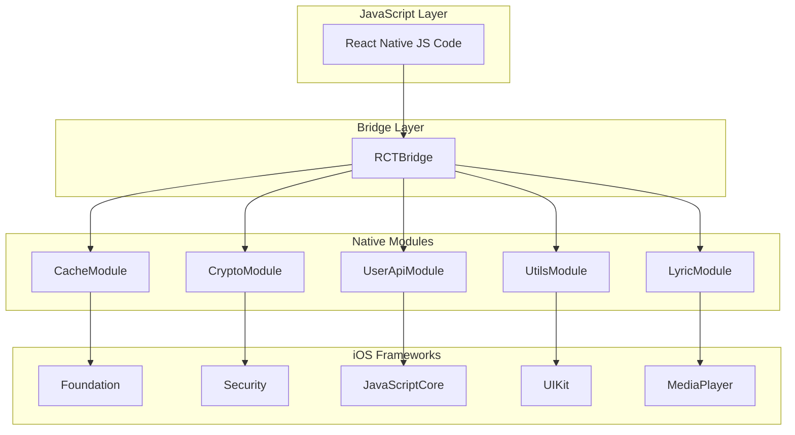

# 设计文档

## 概述

本设计文档描述了将 LxMusicMobile 项目迁移到 iOS 平台的技术实现方案。主要包括 5 个原生模块的 iOS 实现、Info.plist 配置、资源文件配置以及构建签名配置。

iOS 原生模块使用 Objective-C 实现，遵循 React Native 的原生模块规范。由于 iOS 不支持悬浮窗功能，LyricModule 将采用替代方案，通过 Now Playing Info 和内部状态管理来提供歌词功能。

## 架构



## 组件和接口

### CacheModule

负责应用缓存的管理，包括获取缓存大小和清理缓存。

```objc
// CacheModule.h
#import <React/RCTBridgeModule.h>

@interface CacheModule : NSObject <RCTBridgeModule>
@end

// 导出方法
- (void)getAppCacheSize:(RCTPromiseResolveBlock)resolve
                 reject:(RCTPromiseRejectBlock)reject;
- (void)clearAppCache:(RCTPromiseResolveBlock)resolve
               reject:(RCTPromiseRejectBlock)reject;
```

**实现细节：**
- 使用 `NSFileManager` 遍历 Caches 和 tmp 目录
- 异步执行清理操作避免阻塞主线程
- 返回字节数的字符串格式以保持与 Android 一致

### CryptoModule

提供 RSA 和 AES 加解密功能。

```objc
// CryptoModule.h
#import <React/RCTBridgeModule.h>

@interface CryptoModule : NSObject <RCTBridgeModule>
@end

// RSA 方法
- (void)generateRsaKey:(RCTPromiseResolveBlock)resolve
                reject:(RCTPromiseRejectBlock)reject;
- (void)rsaEncrypt:(NSString *)text
               key:(NSString *)key
           padding:(NSString *)padding
           resolve:(RCTPromiseResolveBlock)resolve
            reject:(RCTPromiseRejectBlock)reject;
- (void)rsaDecrypt:(NSString *)text
               key:(NSString *)key
           padding:(NSString *)padding
           resolve:(RCTPromiseResolveBlock)resolve
            reject:(RCTPromiseRejectBlock)reject;
- (NSString *)rsaEncryptSync:(NSString *)text
                         key:(NSString *)key
                     padding:(NSString *)padding;
- (NSString *)rsaDecryptSync:(NSString *)text
                         key:(NSString *)key
                     padding:(NSString *)padding;

// AES 方法
- (void)aesEncrypt:(NSString *)text
               key:(NSString *)key
                iv:(NSString *)iv
              mode:(NSString *)mode
           resolve:(RCTPromiseResolveBlock)resolve
            reject:(RCTPromiseRejectBlock)reject;
- (void)aesDecrypt:(NSString *)text
               key:(NSString *)key
                iv:(NSString *)iv
              mode:(NSString *)mode
           resolve:(RCTPromiseResolveBlock)resolve
            reject:(RCTPromiseRejectBlock)reject;
- (NSString *)aesEncryptSync:(NSString *)text
                         key:(NSString *)key
                          iv:(NSString *)iv
                        mode:(NSString *)mode;
- (NSString *)aesDecryptSync:(NSString *)text
                         key:(NSString *)key
                          iv:(NSString *)iv
                        mode:(NSString *)mode;
```

**实现细节：**
- RSA 使用 Security.framework 的 `SecKeyCreateRandomKey` 生成密钥对
- RSA 加解密使用 `SecKeyCreateEncryptedData` 和 `SecKeyCreateDecryptedData`
- AES 使用 CommonCrypto 的 `CCCrypt` 函数
- 支持 OAEP 和 NoPadding 填充模式
- 支持 CBC 和 ECB 加密模式

### LyricModule

iOS 替代方案，不使用悬浮窗，而是通过内部状态管理和 Now Playing Info 提供歌词功能。

```objc
// LyricModule.h
#import <React/RCTBridgeModule.h>
#import <React/RCTEventEmitter.h>

@interface LyricModule : RCTEventEmitter <RCTBridgeModule>

@property (nonatomic, strong) NSString *currentLyric;
@property (nonatomic, strong) NSString *translation;
@property (nonatomic, strong) NSString *romaLyric;
@property (nonatomic, assign) BOOL isShowTranslation;
@property (nonatomic, assign) BOOL isShowRoma;
@property (nonatomic, assign) float playbackRate;

@end

// 导出方法（保持与 Android 接口一致）
- (void)showDesktopLyric:(NSDictionary *)data
                 resolve:(RCTPromiseResolveBlock)resolve
                  reject:(RCTPromiseRejectBlock)reject;
- (void)hideDesktopLyric:(RCTPromiseResolveBlock)resolve
                  reject:(RCTPromiseRejectBlock)reject;
- (void)setLyric:(NSString *)lyric
     translation:(NSString *)translation
       romaLyric:(NSString *)romaLyric
         resolve:(RCTPromiseResolveBlock)resolve
          reject:(RCTPromiseRejectBlock)reject;
- (void)play:(int)time
     resolve:(RCTPromiseResolveBlock)resolve
      reject:(RCTPromiseRejectBlock)reject;
- (void)pause:(RCTPromiseResolveBlock)resolve
       reject:(RCTPromiseRejectBlock)reject;
- (void)checkOverlayPermission:(RCTPromiseResolveBlock)resolve
                        reject:(RCTPromiseRejectBlock)reject;
- (void)openOverlayPermissionActivity:(RCTPromiseResolveBlock)resolve
                               reject:(RCTPromiseRejectBlock)reject;
```

**实现细节：**
- 保持与 Android 相同的 JavaScript 接口
- `checkOverlayPermission` 和 `openOverlayPermissionActivity` 直接返回成功
- 歌词数据存储在模块内部，供 JavaScript 层查询
- 可选：通过 `MPNowPlayingInfoCenter` 更新锁屏歌词信息

### UserApiModule

使用 JavaScriptCore 执行用户自定义脚本。

```objc
// UserApiModule.h
#import <React/RCTBridgeModule.h>
#import <React/RCTEventEmitter.h>
#import <JavaScriptCore/JavaScriptCore.h>

@interface UserApiModule : RCTEventEmitter <RCTBridgeModule>

@property (nonatomic, strong) JSContext *jsContext;
@property (nonatomic, strong) dispatch_queue_t jsQueue;

@end

// 导出方法
- (void)loadScript:(NSDictionary *)data;
- (BOOL)sendAction:(NSString *)action info:(NSString *)info;
- (void)destroy;
```

**实现细节：**
- 使用 `JSContext` 创建独立的 JavaScript 执行环境
- 在后台队列执行脚本避免阻塞主线程
- 注入原生方法供脚本调用（加密、Base64、MD5 等）
- 支持 `setTimeout` 定时器功能
- 加载预置的 `user-api-preload.js` 脚本

### UtilsModule

提供各种实用工具功能。

```objc
// UtilsModule.h
#import <React/RCTBridgeModule.h>
#import <React/RCTEventEmitter.h>

@interface UtilsModule : RCTEventEmitter <RCTBridgeModule>
@end

// 导出方法
- (void)screenkeepAwake;
- (void)screenUnkeepAwake;
- (void)getWIFIIPV4Address:(RCTPromiseResolveBlock)resolve
                    reject:(RCTPromiseRejectBlock)reject;
- (void)getDeviceName:(RCTPromiseResolveBlock)resolve
               reject:(RCTPromiseRejectBlock)reject;
- (void)shareText:(NSString *)shareTitle
            title:(NSString *)title
             text:(NSString *)text;
- (void)getSystemLocales:(RCTPromiseResolveBlock)resolve
                  reject:(RCTPromiseRejectBlock)reject;
- (void)getWindowSize:(RCTPromiseResolveBlock)resolve
               reject:(RCTPromiseRejectBlock)reject;
- (void)getSupportedAbis:(RCTPromiseResolveBlock)resolve
                  reject:(RCTPromiseRejectBlock)reject;
- (void)exitApp;
- (void)isNotificationsEnabled:(RCTPromiseResolveBlock)resolve
                        reject:(RCTPromiseRejectBlock)reject;
- (void)openNotificationPermissionActivity:(RCTPromiseResolveBlock)resolve
                                    reject:(RCTPromiseRejectBlock)reject;
```

**实现细节：**
- 屏幕常亮使用 `UIApplication.shared.isIdleTimerDisabled`
- WiFi IP 使用 `getifaddrs` 获取网络接口信息
- 设备名称使用 `UIDevice.current.name`
- 分享使用 `UIActivityViewController`
- 系统语言使用 `Locale.preferredLanguages`
- 窗口大小使用 `UIScreen.main.bounds`
- 通知权限使用 `UNUserNotificationCenter`

## 数据模型

### RSA 密钥对结构

```typescript
interface RSAKeyPair {
  publicKey: string;   // Base64 编码的公钥
  privateKey: string;  // Base64 编码的私钥（PKCS#8 格式）
}
```

### 脚本信息结构

```typescript
interface ScriptInfo {
  id: string;
  name: string;
  description: string;
  version: string;
  author: string;
  homepage: string;
  script: string;
}
```

### 窗口大小结构

```typescript
interface WindowSize {
  width: number;
  height: number;
}
```

### 歌词数据结构

```typescript
interface LyricData {
  lyric: string;
  translation: string;
  romaLyric: string;
}
```


## 正确性属性

*正确性属性是一种应该在系统所有有效执行中保持为真的特征或行为——本质上是关于系统应该做什么的形式化陈述。属性作为人类可读规范和机器可验证正确性保证之间的桥梁。*

### Property 1: RSA 加解密往返一致性

*对于任意* 有效的明文数据和 RSA 密钥对，使用公钥加密后再使用私钥解密，应该得到与原始明文相同的数据。

**验证: 需求 2.2, 2.3, 2.4**

### Property 2: AES 加解密往返一致性

*对于任意* 有效的明文数据、密钥、IV 和加密模式，加密后再解密应该得到与原始明文相同的数据。

**验证: 需求 2.5, 2.6, 2.7**

### Property 3: 缓存清理有效性

*对于任意* 缓存目录中的文件集合，调用 clearAppCache 后，缓存目录应该为空或只包含系统保护的文件。

**验证: 需求 1.2**

### Property 4: 缓存大小计算准确性

*对于任意* 已知大小的缓存文件集合，getAppCacheSize 返回的大小应该等于所有文件大小的总和。

**验证: 需求 1.1**

### Property 5: 歌词状态存储一致性

*对于任意* 歌词文本、翻译和罗马音数据，调用 setLyric 后再查询，应该得到与设置时相同的数据。

**验证: 需求 3.3**

### Property 6: 脚本动作传递完整性

*对于任意* 动作名称和数据，调用 sendAction 后，脚本环境应该收到完全相同的动作和数据。

**验证: 需求 4.3**

### Property 7: Base64 编解码往返一致性

*对于任意* 有效的字符串数据，Base64 编码后再解码应该得到与原始数据相同的结果。

**验证: 需求 4.7**

### Property 8: 窗口大小返回值有效性

*对于任意* 调用 getWindowSize，返回的宽度和高度应该都是正整数，且与实际屏幕尺寸一致。

**验证: 需求 5.7**

### Property 9: WiFi IP 地址格式有效性

*对于任意* 调用 getWIFIIPV4Address，如果设备连接到 WiFi，返回值应该是有效的 IPv4 地址格式（x.x.x.x）。

**验证: 需求 5.3**

### Property 10: 原生模块可访问性

*对于任意* 已注册的原生模块，在 React Native 初始化完成后，JavaScript 层应该能够访问该模块的所有导出方法。

**验证: 需求 9.2**

## 错误处理

### CacheModule 错误处理

| 错误场景 | 处理方式 |
|---------|---------|
| 文件系统访问失败 | 返回 Promise reject，包含错误描述 |
| 目录不存在 | 静默忽略，返回 0 或成功 |
| 权限不足 | 返回 Promise reject，包含权限错误信息 |

### CryptoModule 错误处理

| 错误场景 | 处理方式 |
|---------|---------|
| 无效的密钥格式 | 返回空字符串或 Promise reject |
| 加密/解密失败 | 返回空字符串，打印错误日志 |
| 不支持的填充模式 | 返回空字符串 |

### UserApiModule 错误处理

| 错误场景 | 处理方式 |
|---------|---------|
| 脚本语法错误 | 发送 error 事件，包含错误信息 |
| 脚本运行时错误 | 发送 error 事件，截断过长的错误信息 |
| 预加载脚本加载失败 | 返回初始化失败 |

### UtilsModule 错误处理

| 错误场景 | 处理方式 |
|---------|---------|
| 无法获取 WiFi IP | 返回 null 或 "0.0.0.0" |
| 无法获取窗口大小 | 返回 {width: 0, height: 0} |
| 分享失败 | 静默失败，不影响应用运行 |

## 测试策略

### 单元测试

单元测试用于验证特定示例和边界情况：

1. **CacheModule 测试**
   - 测试空缓存目录的大小计算
   - 测试清理后目录状态

2. **CryptoModule 测试**
   - 测试已知明文的加解密结果
   - 测试不同填充模式的兼容性
   - 测试空字符串和特殊字符处理

3. **LyricModule 测试**
   - 测试接口兼容性
   - 测试权限检查方法返回值

4. **UserApiModule 测试**
   - 测试脚本加载和销毁
   - 测试错误脚本的处理

5. **UtilsModule 测试**
   - 测试各方法的返回值格式
   - 测试 iOS 特定行为（如 exitApp）

### 属性测试

属性测试用于验证通用属性在所有输入上的正确性：

- 每个属性测试至少运行 100 次迭代
- 使用 XCTest 框架配合随机数据生成
- 每个测试标注对应的设计属性编号

**测试标签格式**: `Feature: ios-migration, Property N: 属性描述`

### 集成测试

1. **React Native 桥接测试**
   - 验证所有模块从 JavaScript 层可访问
   - 验证方法调用和回调正确工作

2. **构建测试**
   - 验证 Debug 构建成功
   - 验证 Release 构建成功
   - 验证 Archive 导出成功

## 文件结构

```
ios/
├── LxMusicMobile/
│   ├── AppDelegate.h
│   ├── AppDelegate.mm
│   ├── Info.plist
│   ├── LaunchScreen.storyboard
│   ├── main.m
│   ├── Images.xcassets/
│   │   ├── AppIcon.appiconset/
│   │   └── Contents.json
│   └── Modules/
│       ├── Cache/
│       │   ├── CacheModule.h
│       │   └── CacheModule.m
│       ├── Crypto/
│       │   ├── CryptoModule.h
│       │   ├── CryptoModule.m
│       │   ├── RSAUtils.h
│       │   ├── RSAUtils.m
│       │   ├── AESUtils.h
│       │   └── AESUtils.m
│       ├── Lyric/
│       │   ├── LyricModule.h
│       │   └── LyricModule.m
│       ├── UserApi/
│       │   ├── UserApiModule.h
│       │   └── UserApiModule.m
│       └── Utils/
│           ├── UtilsModule.h
│           └── UtilsModule.m
├── Podfile
└── LxMusicMobile.xcodeproj/
    └── project.pbxproj
```

## 依赖项

### iOS 系统框架

- **Foundation**: 基础数据类型和文件操作
- **Security**: RSA 密钥生成和加解密
- **CommonCrypto**: AES 加解密
- **JavaScriptCore**: JavaScript 脚本执行
- **UIKit**: UI 相关功能
- **MediaPlayer**: Now Playing Info 更新
- **UserNotifications**: 通知权限管理

### CocoaPods 依赖

现有 Podfile 已配置的依赖保持不变：
- react-native-navigation
- React Native 核心依赖

## 平台差异处理

| 功能 | Android | iOS |
|-----|---------|-----|
| 桌面歌词 | 悬浮窗显示 | Now Playing Info + 内部状态 |
| 悬浮窗权限 | 需要申请 | 不需要（直接返回成功） |
| 退出应用 | 可程序化退出 | 不支持，提示用户 |
| 安装 APK | 支持 | 不适用 |
| 电池优化 | 支持检查和请求 | 不适用 |
| JavaScript 引擎 | QuickJS | JavaScriptCore |
